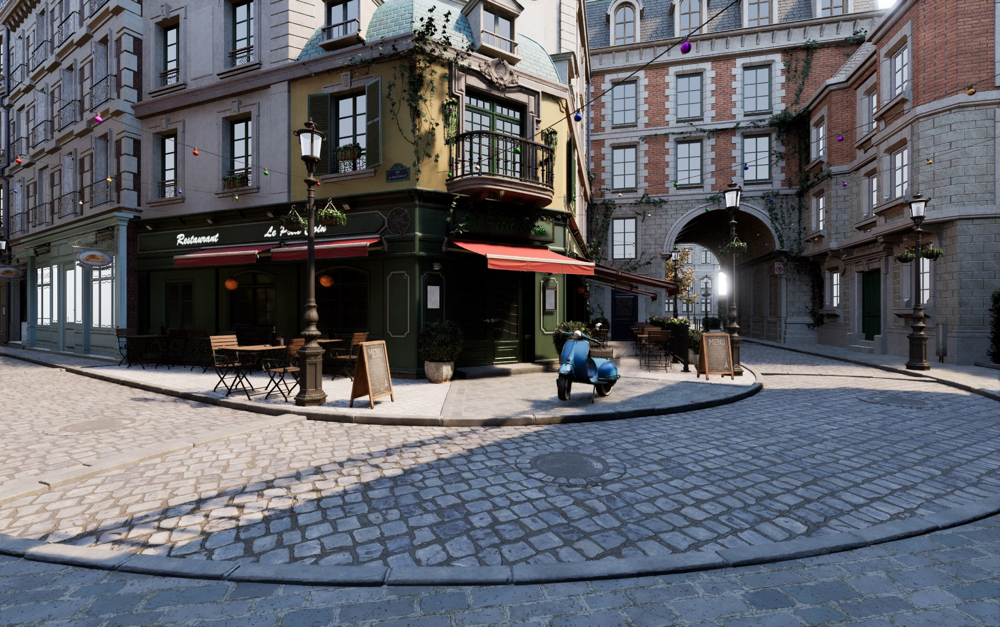
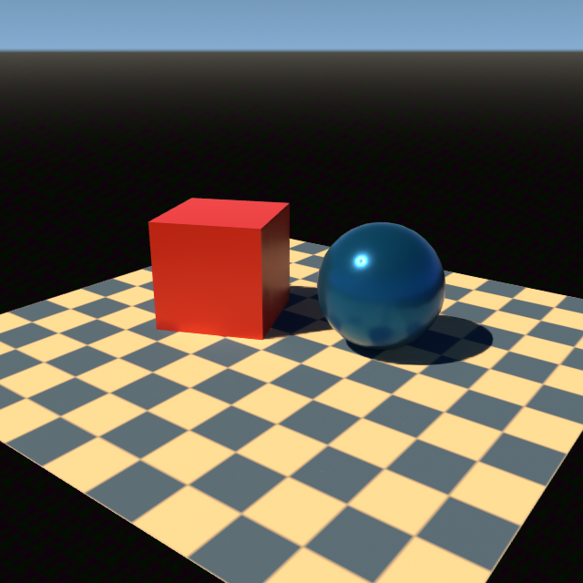

# Native Metal ray tracing for Godot

> [!WARNING]
> This is an experimental demo fork, not an official Godot release and not a
> production-ready renderer. Its intended destination is ultimately a pull
> request to [NVIDIA-RTX/godot](https://github.com/NVIDIA-RTX/godot), where the
> upstream path-tracing work lives. Do not use it for shipping projects.

This repository is a fork of NVIDIA's in-progress Godot path-tracing/DLSS fork.
The `metal_rt` branch carries the Metal implementation intended for that work;
this default branch is the companion project page and hackathon submission: the
story, tests, benchmark, and reproducible evidence behind the macOS port.



*[Bistro demo](https://github.com/Jamsers/Bistro-Demo-Tweaked) rendered by the
current Apple Silicon build with native Metal ray tracing and MetalFX Denoised
Upscaling enabled.*

## What it does

The NVIDIA branch adds path tracing to Godot's Forward+ renderer. This fork
adds an Apple Silicon path through native Metal ray tracing: acceleration
structure construction, TLAS/BLAS lifetime management, shader lowering and
ray-query traversal, hit/material dispatch, path-tracer integration, runtime
capability gating, and a clean fallback when RT is unavailable. It also includes
focused GPU tests, image comparison, editor fixtures, and presentation work for
MetalFX where the device supports it.



*The tracked HG0 editor fixture used by the regression runner: textured floor,
diffuse box, reflective sphere, and MetalFX denoising.*

## Why this exists

I was inspired by [Leroy Sikkes' GodotCon talk](https://www.youtube.com/watch?v=rYmpJYfaYm0),
where an NVIDIA engineer who has worked on path tracing in games including
Cyberpunk 2077 and Battlefield 1 describes bringing it to Godot. That upstream
pull request is still a major work in progress, with broad compatibility work
ahead and Vulkan as its initial target.

As an Apple Silicon and Godot fan, I wanted to see the same direction working
on my own Mac. This is a practical exploration of what native Metal support
would take—not an attempt to replace, bypass, or pre-empt the upstream project.

## How GPT-5.6 helped

GPT-5.6 was the research and implementation partner, not an autopilot. I first
had it examine the NVIDIA fork, identify the Mac gap, and split the port into
small, verifiable chunks. That research and the test contract are kept in
[`mac-rt-planning/`](mac-rt-planning/).

I also gave the agents a local Blender source checkout as a concrete reference:
Apple's Blender work was especially useful for understanding how a native Metal
intersector implementation should be shaped. GPT-5.6 then helped create narrow
tools for shader passes, test artifacts, and image comparisons, and worked
through the port one chunk at a time. After every chunk I built it, ran tests,
investigated crashes and visual failures, and reviewed the result.

Terra was particularly useful for repository-scale research, while Luna helped
with computer-use tasks. The important part was orchestration: giving the model
specific references, small acceptance criteria, and real test feedback.

## Benchmark

The included [`benchmark/`](benchmark/) project reproduces the orbiting-camera
workload used here: 1920×1080, path tracing enabled, a 3×3 SPP/bounce matrix,
two repeats per configuration, and 400 measured frames after warmup. It records
hardware, OS, renderer, capability gate, frame-time percentiles, and the GPU
Pathtracer pass time. Generated results, logs, and builds are intentionally
ignored.

The results below are two-run means recorded with build `eeac9e05d` on
2026-07-22. Each row uses 240 measured frames after warmup at 1920×1080; the
**bold row** is the **4 SPP / 2 bounce** reference configuration.

| SPP | Bounces | M5 FPS | M5 GPU pass |
| ---: | ---: | ---: | ---: |
| 1 | 1 | 184.4 | 3.8 ms |
| 1 | 2 | 119.9 | 4.8 ms |
| 1 | 4 | 120.0 | 5.6 ms |
| 4 | 1 | 72.6 | 14.0 ms |
| **4** | **2** | **53.8** | **18.4 ms** |
| 4 | 4 | 49.1 | 20.2 ms |
| 16 | 1 | 22.4 | 44.5 ms |
| 16 | 2 | 15.5 | 64.2 ms |
| 16 | 4 | 12.7 | 78.6 ms |

"GPU pass" is the Pathtracer pass time alone; FPS is the whole frame. The
first three configurations are constrained by display pacing on this desktop,
so the GPU pass timing is the more reliable comparison there.

| Machine | Chip | macOS | Metal RT |
| --- | --- | --- | --- |
| MacBook Pro (Mac17,2) | Apple M5 (Apple9) | 26.5.2 | enabled |

Intel Mac support is being worked on; do not treat a fallback result as an RT
benchmark. PRs that add your own benchmark results—with machine details, exact
build/commit, matrix settings, and a concise result table—would be very
welcome. Please leave generated logs, `benchmark-results/`, and binaries out
of the commit.

### Run it

Build an Apple Silicon editor from this checkout, then run:

```bash
./benchmark/RUN\ BENCHMARK.command
```

The runner first looks for a packaged `Godot Metal RT.app` next to the repo,
then falls back to `bin/godot.macos.editor.arm64`. It writes timestamped results
under `benchmark-results/`. For a short smoke run, use:

```bash
GODOT_BENCHMARK_QUICK=1 ./benchmark/RUN\ BENCHMARK.command
```

## Build and test

This project currently targets Apple Silicon and the Metal renderer. A typical
local build is:

```bash
scons platform=macos target=editor arch=arm64 metal=yes vulkan=no angle=no accesskit=no
```

The shared RT test entry point is:

```bash
python3 tests/metal_rt/run_mac_rt_tests.py --stage gpu --stage image \
  --binary bin/godot.macos.editor.arm64
```

The testing standard and local runner details are in
[`mac-rt-planning/testing-standard.md`](mac-rt-planning/testing-standard.md) and
[`mac-rt-planning/automation.md`](mac-rt-planning/automation.md).

## What is next

- Intel support and a universal release package.
- More path-tracer optimizations and compatibility work.
- Continued validation on real Godot scenes and more Apple Silicon machines.
- Preparing the focused `metal_rt` branch as a contribution back to the NVIDIA
  fork, subject to its review and to Godot's contribution policies.

The first public binary, when explicitly approved, will be a **pre-1.0
release** (`v0.1.0-preview.1`). It will be clearly labelled as a demo
package for testing this fork and benchmark—not a general-purpose Godot build.
