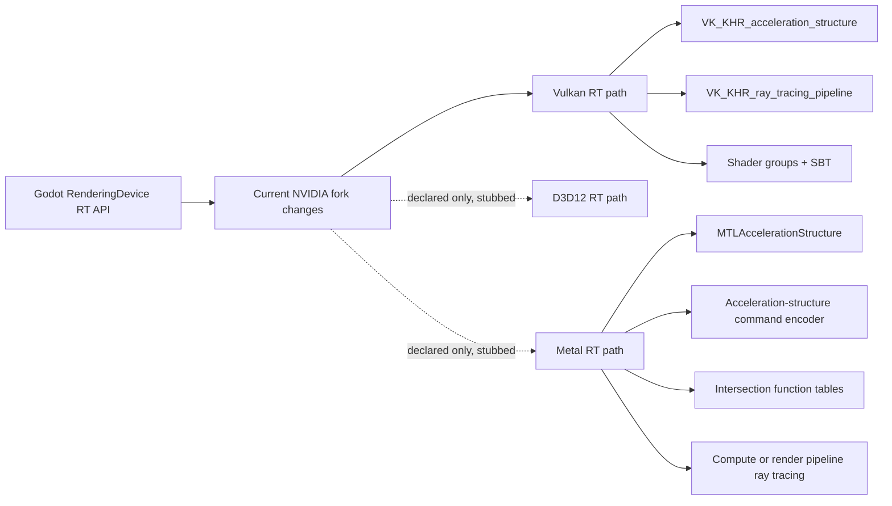
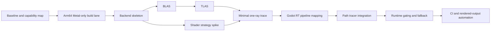

# NVIDIA-RTX Godot macOS Metal Port Assessment

> Implementation companions: [`testing-standard.md`](testing-standard.md)
> defines the required evidence and merge gates, while
> [`automation.md`](automation.md) documents the repeatable local runner.

## Executive summary

The `NVIDIA-RTX/godot` fork is **not currently usable for native Metal ray tracing on macOS**. The branch differs from `master` by **two NVIDIA-authored commits** that touch **213 files**, centered on dependencies, a path tracer, DLSS, and related rendering changes. The fork already contains Godot’s upstream macOS platform port and Godot’s upstream Metal rendering backend, but the Metal backend’s ray-tracing entry points are still **interface-only stubs** that fail with “Ray tracing is not currently supported by the Metal driver.” citeturn46view0turn22view0turn52view1

The macOS side of the fork is materially better than a “no-Metal” baseline: there is a full `drivers/metal` backend, it already compiles SPIR-V to MSL using **SPIRV-Cross**, builds Metal libraries with `xcrun metal`, links `Metal`, `MetalKit`, and `MetalFX`, and has a dedicated `macos_builds.yml` GitHub Actions workflow. But that support stops short of ray tracing. The current macOS build logic enables the Metal rendering driver only on **arm64**, while `x86_64` macOS builds still exist for editor/template smoke testing and Vulkan/MoltenVK paths. citeturn51view0turn28view0turn24view0turn44view0

The practical implication is straightforward: porting NVIDIA’s additions to native Metal is **not** a matter of flipping a build flag or translating a few shaders. It requires implementing the missing Metal acceleration-structure and dispatch path behind Godot’s generic ray-tracing interfaces, deciding how to map Godot’s Vulkan-oriented ray-tracing abstractions onto Metal’s acceleration-structure command encoders and intersection-function tables, and extending CI beyond today’s compile-and-unit-test coverage. citeturn52view1turn22view0turn50search0turn50search1turn44view0

Because your requested target macOS versions and GPU families are unspecified, the safest planning assumption is: **first shipping scope = Apple Silicon macOS only**, gated at runtime by Metal feature checks, with more advanced feature use gated again for newer Apple GPU families. Apple’s current feature tables show ray tracing in compute and render pipelines beginning at **Apple6**, while several higher-end ray-tracing-adjacent capabilities are only available starting at **Apple9**. citeturn49view0turn49view1turn50search21

## Repository state

The table below summarizes the parts of the fork that matter most for macOS and Metal porting.

| Area | Current state | Evidence | Porting implication |
|---|---|---|---|
| Fork delta versus upstream `master` | Branch comparison shows **2 commits**, **213 files changed**, both dated Jun 16, 2026: `NVIDIA: Dependencies` and `NVIDIA: Pathtracer + DLSS`. citeturn46view0 | Compare page between `master` and `nvidia-pt-dlss`. citeturn46view0 | The NVIDIA work is sizable at the rendering layer, but it is concentrated in a small number of fork commits, which is good for scoping and diff review. |
| macOS platform code | `platform/macos` is a full platform port with many `.mm` Objective-C++ sources such as `display_server_macos.mm`, `godot_main_macos.mm`, `libgodot_macos.mm`, and `rendering_context_driver_vulkan_macos.mm`. The folder README says it contains the C++, Objective-C, and Objective-C++ code for the macOS port. citeturn54view0turn23view1 | `platform/macos` tree listing and README. citeturn54view0turn23view1 | The platform layer already exists; the missing work is not “bring Godot to macOS,” but “wire ray tracing into the existing Metal renderer and macOS build/runtime paths.” |
| Metal backend presence | `drivers/metal` already exists and includes `rendering_context_driver_metal.*`, `rendering_device_driver_metal.*`, `rendering_device_driver_metal3.*`, `rendering_shader_container_metal.*`, device/profile/property files, and a README. citeturn53view0turn53view1 | `drivers/metal` tree listing. citeturn53view0turn53view1 | You are porting into an existing backend, not creating one from scratch. That sharply lowers the non-RT bring-up cost. |
| Metal build pipeline | `drivers/metal/SCsub` pulls in **metal-cpp** and **SPIRV-Cross**, enables exceptions for SPIRV-Cross, switches the backend to **GNU++20**, enables modules, and builds all `*.cpp` files in the driver. citeturn51view0turn51view1turn51view2turn51view3turn51view4 | `drivers/metal/SCsub`. citeturn51view0turn51view1 | The shader toolchain and build integration for Metal already exist; ray-tracing work can reuse this foundation, though not unchanged. |
| Metal shader path | The Metal shader container already invokes `xcrun metal`, targets specific OS versions, and uses **SPIRV-Cross `CompilerMSL`** for SPIR-V→MSL conversion. It also does capability-aware fallback when pre-baked shaders exceed the target profile. citeturn28view0turn29view1turn29view5 | `rendering_shader_container_metal.cpp`. citeturn28view0turn29view1turn29view5 | Existing raster/compute shader compilation is a strong asset. The main unresolved question is how much of the Vulkan RT shader model can reuse this path versus needing a Metal-specific lane. |
| macOS build gating | `platform/macos/detect.py` reports `metal: True`, but if `arch != arm64`, it warns that the architecture does not support the Metal rendering driver and disables it. The same file sets **macOS 11.0+** for arm64 builds and **10.13+** for x86_64 builds. citeturn24view0 | `platform/macos/detect.py`. citeturn24view0 | First-class Metal work should target Apple Silicon. Intel macOS can remain build-only or Vulkan/MoltenVK-only unless you explicitly choose a broader support scope. |
| Vulkan-on-macOS path | The macOS detect script links `Metal`; if Vulkan is enabled and `use_volk` is false, it links `MoltenVK` and locates a Vulkan SDK for macOS. citeturn24view0 | `platform/macos/detect.py`. citeturn24view0 | The fork already supports Vulkan-on-Metal translation via MoltenVK for non-native Vulkan use cases. That is not a substitute for native Metal RT, but it is relevant for parity testing and fallback behavior. |
| Current Metal RT implementation status | The Metal driver header declares the full Godot RT surface — BLAS/TLAS creation, RT pipeline creation, SBT handle retrieval, build/update/trace commands — but the `.cpp` implementation currently returns errors for all of them, stating ray tracing is not supported by the Metal driver. citeturn52view1turn52view2turn22view0 | `rendering_device_driver_metal.h/.cpp`. citeturn52view1turn22view0 | This is the central gap. Most of the port is implementing these methods and the support structures they need. |
| NVIDIA touch to Metal code | The Metal driver file history shows an NVIDIA commit on Jun 16, 2026 (`NVIDIA: Pathtracer + DLSS`), but the actual Metal RT methods remain stubs; the fork mainly updated the interface surface so Metal still compiles after generic RT API changes. citeturn26view0turn22view1 | Metal driver history and current implementation. citeturn26view0turn22view1 | The fork acknowledges the generic RT API drift, but does not implement native Metal RT. |
| Windows/NVIDIA-specific stack | `SConstruct` explicitly enables **Streamline** only on Windows, and disables **Aftermath** outside Windows. The repo has one open PR, “Automatic Streamline SDK Download Script,” and its discussion explicitly says Streamline support is Windows-only for now. citeturn35view0turn35view3turn38view0turn40view0 | `SConstruct`, PR list, PR #6 conversation. citeturn35view0turn40view0 | DLSS/Streamline pieces are not directly portable to macOS; native Metal RT should be treated as a rendering-path port, not a DLSS feature port. |
| macOS CI today | The repo ships a `macos_builds.yml` workflow that builds **x86_64** and **arm64**, lipo-merges them into universal binaries, installs ANGLE, AccessKit, and the Vulkan SDK opportunistically, then runs `--version`, `--help`, and `--test --force-colors`. citeturn42view0turn44view0 | `.github/workflows/macos_builds.yml`. citeturn42view0turn44view0 | Good build hygiene already exists, but current CI does not validate Metal ray tracing, GPU feature gating, or rendered outputs. |
| macOS-specific TODOs and issue surface | The Metal README’s current “Future work / ideas” lists **placement heaps**, **explicit hazard tracking**, and **MetalFX upscaling**. The repo has **no open issues**, and issue creation is restricted, so there is no issue tracker signal for macOS/Metal RT in this fork. citeturn53view1turn39view0 | `drivers/metal/README.md` and issues page. citeturn53view1turn39view0 | Planning must rely on code archaeology and upstream Godot behavior more than fork issue discussions. |

Two details matter especially for feasibility. First, the current Metal backend already contains pieces that are directly relevant to a ray-tracing port: GPU-family-aware feature logic, argument-buffer usage, SPIR-V reflection, runtime shader recompilation for underspecified targets, and OS-version gating around features such as GPU addresses and residency sets. Second, none of that currently reaches the RT execution path. Native Metal RT is therefore **feasible**, but it is not “latent” in the codebase; it still has to be implemented. citeturn29view2turn29view3turn22view3turn29view7turn22view0

## Porting analysis

At a high level, the port is a translation problem between two different ray-tracing execution models:



> **Correction (chunk C1 baseline).** An earlier draft of this diagram showed
> D3D12 as an implemented RT path. It is not. As of the frozen baseline
> (`docs/rt_metal_port/baseline.md`), only the **Vulkan** backend implements the
> RT methods; **D3D12 and Metal are both interface-only stubs** that return
> `ERR_FAIL`. Vulkan is therefore the single working reference implementation for
> the Metal port. Even Vulkan RT is compiled out on macOS/iOS
> (`VULKAN_RAYTRACING_ENABLED 0` under `MACOS_ENABLED`/`IOS_ENABLED`), so macOS
> currently has no ray-tracing path of any kind.

The current fork’s generic RT interfaces are already in place on the Metal side — BLAS/TLAS, RT pipeline creation, bind, and trace entry points all exist in the C++ interface — but the implementation is missing. That means the port should preserve the **engine-level API contract** and replace the backend mapping only. citeturn52view1turn22view0

### Architecture differences

On the Vulkan side, official Khronos documentation separates ray tracing into **acceleration structures**, **ray-tracing pipelines**, and optionally **ray queries**. Vulkan’s official samples and guide describe a model built around BLAS/TLAS construction, ray-generation/miss/hit shader groups, and a **Shader Binding Table** that is dispatched through ray-tracing pipeline commands. citeturn41search5turn41search8turn41search11turn41search22

On the Metal side, Apple documents ray tracing in terms of **acceleration structures**, **acceleration-structure command encoders**, and **intersection function tables**, with ray tracing used from compute pipelines and, on capable hardware, render pipelines. Apple’s feature tables also show that support is hardware-family gated, beginning at **Apple6** for ray tracing in compute and render pipelines, with several more advanced capabilities not arriving until **Apple9**. citeturn50search0turn50search1turn50search7turn49view0turn49view1

The biggest architectural consequence is that **Vulkan’s SBT-centric model does not map 1:1 onto Metal’s function-table-centric model**. A Metal port therefore needs an internal translation layer rather than a literal reimplementation of Vulkan objects. That is partly an inference from the two official models, but it is strongly supported by the fact that Apple exposes intersection-function tables and acceleration-structure encoders, while Vulkan exposes shader groups and SBT-oriented dispatch. citeturn41search11turn50search1turn50search14

### Shader translation and pipeline construction

The good news is that the upstream Metal backend already compiles SPIR-V-derived MSL with **SPIRV-Cross `CompilerMSL`**, uses `xcrun metal`/`metallib`, and tracks GPU-family/MSL-version constraints. It also already reasons about argument-buffer tiers and some feature-dependent shader fallback behavior. citeturn28view0turn29view1turn29view2turn29view3turn29view5

The hard part is that NVIDIA’s path-tracing additions are conceptually aligned with backends that already use explicit RT pipeline objects. In practice, you should expect at least three shader-porting subproblems:

First, ray-generation, miss, hit, callable, and intersection logic must be mapped into whatever Metal-side organization best matches Godot’s internal abstraction. Second, any assumptions about Vulkan shader groups or record layout must be re-expressed through Metal pipeline state, function pointers, and intersection tables. Third, resource binding must be validated against the Metal backend’s current argument-buffer model, because Godot’s own Metal backend already notes that some SPIRV-Cross emulation strategies are incompatible with Godot’s binding layout. citeturn32view1turn41search2turn50search1turn50search14turn29view0

A practical design choice is to keep **one authoring IR**, but allow **backend-specific lowering**. Since the fork already uses SPIR-V as a central intermediate for Metal raster/compute compilation, the lowest-risk approach is to preserve that where possible and add a Metal-specific lowerer for RT-specific constructs when the existing SPIRV-Cross path proves insufficient. That is an engineering recommendation, not a repository fact, but it follows from the current backend structure. citeturn28view0turn29view1

### Acceleration structures, command encoding, and synchronization

Apple’s RT model uses `MTLAccelerationStructure` objects created and populated via an `MTLAccelerationStructureCommandEncoder`, with build, copy/compact, and scratch-buffer operations encoded from a command buffer. That maps conceptually to Godot’s BLAS/TLAS methods, but the implementation details are Apple-specific and need new backend structures. citeturn50search0turn50search7turn50search10turn50search22turn50search25

That work should not start from zero. The existing Metal driver already handles ordinary resource creation, tracks device properties, exposes buffer allocation and mapping, and has some OS-gated features such as `gpuAddress()` support starting on macOS 13.0 and optional residency/barrier behavior in the Metal 3 path. If your eventual RT design depends on GPU virtual addresses or more explicit residency control, that can raise the true minimum OS and hardware scope beyond the nominal floor. That constraint is not fully specified by the fork today, so it should remain an explicit open question in the port plan. citeturn22view3turn29view7turn52view0

Resource-format and binding compatibility also need deliberate validation. Apple’s feature tables show family-dependent availability for texture atomics, 64-bit atomics, sparse resources, and other features that often matter to path tracers and denoisers. The existing Metal shader container already contains GPU-family guards for atomics and feature-derived MSL requirements, which is a useful precedent for RT capability gating. citeturn49view0turn49view1turn29view3turn29view4

### Build, packaging, and CI implications

The fork already has most of the build plumbing you want: a macOS workflow, ARM and x86 targets, optional Vulkan SDK installation, and universal-binary packaging. But that workflow only proves that the code compiles and that the non-GPU unit-test surface boots. It does **not** exercise native Metal RT, compare rendered outputs, or assert family/OS capability behavior. citeturn44view0

That means the build-system work for this port is moderate, while the **CI observability work** is substantial. You will need compile-time feature flags, runtime capability logging, artifacted shader compilation diagnostics, and at least one self-hosted Apple Silicon runner or lab machine for rendered-output validation. GitHub-hosted macOS runners are fine for compile coverage, but not sufficient for feature-complete RT validation. That last sentence is an implementation recommendation based on the current workflow and Apple’s hardware-family gating. citeturn44view0turn49view0turn50search21

## Verifiable work chunks

The plan below is optimized for 1–3 day tasks that are easy to hand to iterative LLM-driven development. The emphasis is on producing artifacts that are simple to review: compile logs, JSON capability dumps, small backend classes, isolated tests, and image-based correctness checks.

| Chunk | Goal | Inputs | Expected outputs and artifacts | Verification steps | Effort | Dependencies |
|---|---|---|---|---|---|---|
| C1 | Freeze a reproducible baseline | Current `nvidia-pt-dlss` branch; compare against `master` | `docs/rt_metal_port/baseline.md` with touched RT files, backend entry points, and current macOS/Metal exclusions | Reproduce the two-commit diff scope and list all RT-related files; confirm Metal RT methods are still stubs. citeturn46view0turn22view0 | 1 day | None |
| C2 | Build a capability inventory for macOS + Metal | `drivers/metal`, `platform/macos/detect.py`, Apple feature gating | `docs/rt_metal_port/capability_matrix.json` and `docs/rt_metal_port/assumptions.md` | Compile and run a tiny capability probe that logs `supportsFamily(...)`, RT availability, argument-buffer tier, and OS version; compare against Apple-family expectations. citeturn24view0turn49view0turn50search21 | 1 day | C1 |
| C3 | Make macOS arm64 Metal-only builds first-class | Existing macOS workflow and SCons flags | New CI job or local script for `platform=macos arch=arm64 vulkan=no angle=no` smoke build; compile database if desired | Confirm clean arm64 build, editor boot, `--version`, `--help`, `--test`; artifact compile logs. Current workflow already proves the general pattern. citeturn44view0turn34view0 | 1 day | C1 |
| C4 | Define the Metal RT backend skeleton behind Godot’s interface | `rendering_device_driver_metal.h/.cpp` | New internal classes for Metal BLAS/TLAS handles, scratch-size queries, and pipeline placeholders; no tracing yet | Code compiles; existing stub methods replaced with `ERR_FAIL` only where unsupported subpaths remain; unit tests exercise object creation/destruction paths. citeturn52view1turn22view0 | 2 days | C1, C2 |
| C5 | Prototype BLAS build/refit on Metal | Apple acceleration-structure encoder model; Metal backend resource code | Minimal BLAS implementation for triangle geometry, scratch-buffer sizing, build, compaction bookkeeping | Run a focused smoke test that builds a BLAS from a single triangle mesh and logs build/compacted sizes; no render integration yet. citeturn50search0turn50search10turn50search22 | 2–3 days | C4 |
| C6 | Implement TLAS instance write and TLAS build | Godot instance layout, Metal AS descriptors | TLAS build path, instance-buffer writer, transform/instance mask validation | Smoke test: build TLAS with one instance referencing the BLAS from C5; assert build succeeds and round-trip instance parameters are stable. citeturn52view1turn50search0 | 2 days | C5 |
| C7 | Decide and document shader-lowering strategy for RT stages | NVIDIA RT shaders, current SPIR-V→MSL path | `docs/rt_metal_port/shader_strategy.md`, test shaders, and one backend prototype path | Compile one tiny ray query / closest-hit-style experiment to prove whether existing SPIRV-Cross+MSL flow is adequate or where a Metal-specific lowering is required. Existing backend infrastructure already uses SPIRV-Cross and `xcrun metal`. citeturn28view0turn29view1turn29view0 | 2–3 days | C2, C4 |
| C8 | Implement a minimal “trace one ray” execution path | BLAS/TLAS from C5/C6, shader strategy from C7 | A tiny Metal RT pipeline abstraction: pipeline state, intersection-function-table setup, one trace kernel, output image buffer | Golden test renders a trivial scene to a small image and checks deterministic output hash or image diff tolerance. Apple’s API surface is the reference model here. citeturn50search1turn50search14turn41search0 | 2–3 days | C6, C7 |
| C9 | Map Godot RT pipeline abstractions to Metal resources | Godot `raytracing_pipeline_create`, SBT-oriented data model | Backend translation layer from Godot RT pipeline inputs to Metal function/pipeline objects | Unit test creates pipeline from synthetic shader groups and validates stable resource indices, function-table population, and bind order; explicitly document every non-1:1 mapping from SBT semantics. citeturn32view1turn41search11turn50search1 | 2–3 days | C7, C8 |
| C10 | Integrate path-tracer scene launch with native Metal RT | NVIDIA path-tracer fork changes plus Metal RT backend | First internal path-tracer scene rendering on macOS arm64; debug toggle to select Metal RT backend | Launch one controlled scene, produce image artifact, and compare visually plus numerically against a CPU or Vulkan reference where available. citeturn32view0turn32view2 | 2–3 days | C8, C9 |
| C11 | Add runtime gating and graceful fallback | Capability probe results, Apple family requirements | Clear runtime checks, warnings, and fallback to non-RT rendering when unsupported | Test on at least one unsupported configuration and one supported configuration; verify logs explain why RT is disabled when it is. Apple-family gating should reflect documented feature requirements. citeturn49view0turn49view1turn50search21 | 1–2 days | C2, C10 |
| C12 | Extend CI and automated rendering validation | Existing macOS workflow, new smoke tests | Updated workflow plus proposed self-hosted runner job, image diff harness, artifact uploads | Hosted macOS continues compile/unit test coverage; self-hosted Apple Silicon job runs RT smoke scene and uploads PNG + JSON caps + logs. Current workflow is the starting point. citeturn44view0 | 2 days | C3, C10, C11 |

A sensible sequencing looks like this:



The most important management rule is to keep the early chunks **narrow and falsifiable**. “Implement Metal RT” is too large for LLM iteration. “Build one BLAS and log compacted size on arm64 macOS” is small enough to review, rerun, and revert. The chunks above are intentionally shaped that way.

## CI and testing matrix

The current repo already proves that macOS build automation is viable: it runs on `macos-26`, builds both `x86_64` and `arm64`, creates universal binaries, sets up optional Vulkan/ANGLE/AccessKit dependencies, and runs basic editor/unit-test commands. That is a good base, but it is not yet a ray-tracing validation matrix. citeturn44view0

A stronger matrix for native Metal RT should look like this:

| Lane | Hardware / runner | Scope | What it validates |
|---|---|---|---|
| Compile smoke | GitHub-hosted macOS runner, `x86_64` | Build only, `metal=no` path or default-disabled Metal | Ensures Intel macOS build health and no accidental Apple-Silicon assumptions leak into generic code. Current build logic disables Metal outside arm64. citeturn24view0turn44view0 |
| Compile + unit smoke | GitHub-hosted macOS runner, `arm64` | Build, boot, unit tests | Preserves general macOS correctness for the Apple Silicon editor/template binaries. citeturn44view0 |
| RT baseline | Self-hosted Apple Silicon device reporting `supportsFamily(.apple6)` or later | Native Metal RT smoke scene, caps dump, image artifact | Validates minimum-family Metal RT bring-up. Apple lists ray tracing in compute and render pipelines from Apple6 onward. citeturn49view0turn50search21 |
| RT advanced | Self-hosted Apple Silicon device reporting `supportsFamily(.apple9)` or later | Advanced-path tests, larger scenes, optional higher-end features | Validates features Apple documents as arriving later, such as address-driven AS builds and some advanced RT-related capabilities. citeturn49view0turn49view1 |
| Vulkan/MoltenVK comparison | macOS arm64 with Vulkan SDK / MoltenVK installed | Optional parity reference, non-native path | Useful for regression comparison with the existing macOS Vulkan-on-Metal path, but not a substitute for Metal RT correctness. citeturn24view0 |
| Fallback behavior | Unsupported Mac or forced-disable path | Editor boot + scene render without RT | Verifies predictable fallback when caps are insufficient, target GPU family is too old, or RT is disabled by config. citeturn49view0turn50search21 |

Recommended validation categories:

- **Capability validation:** dump OS version, device name, supported GPU families, RT availability, argument-buffer tier, and any optional features your implementation depends on. Apple explicitly recommends family-based capability checks via `supportsFamily`. citeturn50search21turn49view0
- **Build validation:** continue the current `--version`, `--help`, and `--test --force-colors` smoke steps on hosted runners. citeturn44view0
- **Functional RT smoke:** render a tiny deterministic scene that exercises BLAS build, TLAS build, one miss shader, one closest-hit path, and at least one material branch.
- **Image regression:** compare output PNGs against a stored reference using a small tolerance and save diffs as CI artifacts.
- **Stability checks:** run several iterations to flush out resource-lifetime bugs, synchronization errors, and stale argument-buffer bindings.
- **Performance sanity:** measure BLAS/TLAS build time and rays-per-frame for a fixed scene to catch severe regressions early.

Recommended commands and scripts, based on the current repo workflow and the proposed RT additions:

```bash
# Existing dependency/bootstrap pattern used by repo CI
python ./misc/scripts/install_angle.py
sh misc/scripts/install_vulkan_sdk_macos.sh

# Existing-style local compile commands derived from current workflow
scons platform=macos target=editor arch=arm64 dev_mode=yes \
  vulkan=yes angle=yes accesskit=yes

scons platform=macos target=editor arch=x86_64 dev_mode=yes \
  vulkan=yes angle=yes accesskit=yes

# Existing-style smoke tests
./bin/godot.macos.editor.arm64 --version
./bin/godot.macos.editor.arm64 --help
./bin/godot.macos.editor.arm64 --test --force-colors

# Recommended new additions for this port
./bin/godot.macos.editor.arm64 --headless --script tests/rt_metal_caps_dump.gd
./bin/godot.macos.editor.arm64 --headless --script tests/rt_metal_smoke_scene.gd
python tests/image_diff.py artifacts/rt_metal_smoke.png refs/rt_metal_smoke.png
```

The first block reflects the current repo’s dependency and smoke-test approach on macOS. The last three commands are recommended additions for this port, not commands that already exist in the fork today. citeturn44view0turn34view0

## Primary sources

The assessment above is grounded primarily in repository code and official vendor documentation:

- Branch comparison for scope and touched-file count: `master...nvidia-pt-dlss`, showing two NVIDIA commits and 213 changed files. citeturn46view0
- Metal backend tree and README, including current future-work notes and MoltenVK acknowledgment. citeturn53view0turn53view1
- Metal build script `drivers/metal/SCsub`, showing `metal-cpp`, `SPIRV-Cross`, exceptions, C++20, and module settings. citeturn51view0turn51view1turn51view2turn51view3
- Metal shader container and driver implementation, showing current SPIR-V→MSL compilation flow and RT stub status. citeturn28view0turn29view1turn29view5turn22view0turn52view1
- macOS platform detect/build logic, including arm64-only Metal enablement and MoltenVK linking. citeturn24view0
- macOS GitHub Actions workflow, showing the current compile/test surface. citeturn42view0turn44view0
- Repo PR and issue surfaces, showing one Streamline PR and no open issues. citeturn38view0turn40view0turn39view0
- Apple official Metal ray-tracing documentation and feature tables for acceleration structures, intersection-function tables, and GPU-family requirements. citeturn41search0turn41search1turn50search0turn50search1turn49view0turn49view1
- Khronos official Vulkan ray-tracing guide/spec/sample references for the Vulkan-side model being ported from. citeturn41search2turn41search5turn41search8turn41search11turn41search22

Overall assessment: **native macOS/Metal ray tracing is a real porting project, not a small compatibility fix**. The good news is that the fork already has the macOS platform layer, the Metal renderer, the Metal shader toolchain, and the engine-level RT abstraction surface. The bad news is that the specific native Metal RT implementation is still absent, and NVIDIA-specific features such as Streamline/DLSS remain Windows-oriented in this fork. The right plan is therefore to implement native Metal RT in small, verifiable backend slices, beginning with Apple Silicon arm64 capability-gated smoke tests and only then climbing toward full path-tracer integration. citeturn22view0turn24view0turn35view0turn40view0turn44view0
