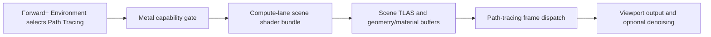

# Metal path-tracing editor parity findings

## Bottom line

Chunks C1-C12 establish the Metal ray-tracing backend, capability gate, narrow
GPU smokes, and a controlled 8x8 compute-lane path-traced image. They do **not**
yet route an editor `Environment` or a real Forward+ scene through that path.

The first visible editor milestone is C13: a StandardMaterial3D-only scene
shader on the Metal compute/ray-query lane, connected to the Forward+
path-tracing frame. Matching the repository's Windows user experience requires
C14-C18 as well: complete scene geometry, material dispatch, procedural
geometry, Mac-appropriate denoising/UI, exports, CI, stability, and performance.

## What "Windows compatibility" means in this fork

The working Windows path is primarily the Vulkan ray-tracing-pipeline path, not
the D3D12 driver. Vulkan implements BLAS/TLAS creation, RT pipelines, shader
binding tables, and `command_trace_rays`. The corresponding D3D12 entry points
are present but still stubbed. Therefore, the parity target for Metal is the
Forward+ editor behavior exposed on Windows when Vulkan RT is available, not
API-for-API D3D12 equivalence.

This distinction matters because Metal cannot consume the same five SPIR-V RT
stages. The Metal port deliberately uses compute plus ray queries/intersectors,
so parity is measured at the scene, material, image, fallback, and export
levels.

## What is already available on Metal

- Metal reports `SUPPORTS_RAY_QUERY` only after the C11 compute-lane capability
  gate succeeds. `SUPPORTS_RAYTRACING_PIPELINE` deliberately remains false.
- BLAS build/refit and TLAS build are implemented and have focused GPU tests.
- SPIRV-Cross ray-query lowering and the native intersector lane have hit/miss
  coverage.
- A native compute pipeline/function-table mapping and deterministic RGBA8
  trace image are covered.
- C10 launches a controlled path-traced scene and compares it with a CPU
  reference.
- C11 proves supported and forced-disabled runtime behavior.
- C12 provides reviewed image regression, an opt-in self-hosted Apple Silicon
  CI lane, and retained diagnostics.

These are backend proofs. The C10 documentation explicitly leaves real
`SceneShaderRaytracing` scene conversion as planned work.

## Why nothing appears in the editor yet

The editor path is stopped at two connected gates:

1. `RenderForwardClustered::_setup_rt()` requires
   `SUPPORTS_RAYTRACING_PIPELINE`. Metal exposes only `SUPPORTS_RAY_QUERY`, so
   `_setup_rt()` returns before it allocates `RenderRaytracing`.
2. Simply widening that condition would be incorrect. `SceneShaderRaytracing`
   still builds ray-generation, miss, closest-hit, any-hit, and intersection
   stages for the Vulkan RT pipeline. Those stages cannot be lowered into the
   Metal compute lane as-is.

The minimum correct editor route is therefore:

C13 must land B-C-E together for the restricted HG0 scene. Enabling the editor
feature flag without a valid Metal scene shader would expose a broken option.

## Gaps between C12 and editor parity

| Area | Current state | Parity requirement | Chunk |
|---|---|---|---|
| Editor routing | `_setup_rt()` accepts RT pipelines only | Accept the Metal ray-query lane only when its scene shader bundle is ready | C13 |
| Standard materials | Controlled hard-coded shader/scene only | Real camera, lights, environment, textures, and HG0 StandardMaterial3D data | C13 |
| Scene geometry | Narrow triangle/TLAS tests | Static meshes, compressed formats, deformed meshes, MultiMesh, rebuild/update, teardown | C14 |
| Alpha/custom shaders | Vulkan hit-group/SBT model | Metal-compatible any-hit/opacity and custom material dispatch | C15 |
| Procedural geometry | Driver primitives exist but no editor route | AABB instances and custom intersection dispatch | C16 |
| Denoising and UI | Environment defaults to DLSS Ray Reconstruction | Supported Mac default, capability-filtered inspector choices, graceful warnings | C17 |
| Distribution | Editor/dev test path | Export templates, exported project, clean final evidence, CI runner, soak/perf | C18 |

## Mac-specific product issues

### Denoiser default

`Environment` currently defaults path tracing to DLSS Ray Reconstruction and
offers only `None` and `DLSS Ray Reconstruction`. Streamline/DLSS is forced off
outside Windows, and the non-Streamline `DLSSEffect` implementation is a no-op.
On Mac, a newly created environment must not silently select an unavailable
denoiser. C17 should make `None` the safe fallback/default unless a supported
native option is implemented, and filter inspector choices by capability.

MetalFX spatial/temporal upscaling already exists elsewhere in the renderer,
but upscaling is not a path-tracing denoiser. It can be part of the presentation
path only after temporal inputs and quality behavior are validated. It must not
be labelled as DLSS Ray Reconstruction parity.

### Shader execution reordering

The scene shader has an NVIDIA-specific SER flag. Metal must mask or replace
that path; it must not advertise SER merely because ray queries work.

### Hardware scope

The native Metal backend is arm64-only in the current build logic. Intel Mac
builds remain compile/smoke lanes using other renderer paths and must fall back
cleanly. GPU evidence must identify the Apple GPU family and OS rather than
claiming generic "macOS" coverage.

## Definition of editor parity

Metal is at the same usable point as the current Windows Vulkan path only when:

1. Path Tracing can be selected in a Forward+ editor project on supported
   Apple Silicon, produces a real scene image, and persists after project
   reload.
2. Standard, alpha-tested, custom spatial, skinned/deformed, instanced, and
   supported procedural geometry take their documented paths.
3. Unsupported features are hidden, disabled, or produce one actionable
   warning and a clean raster/non-RT fallback.
4. Denoiser choices reflect actual Mac capabilities and the default never
   selects the Windows-only DLSS path.
5. An exported arm64 project behaves like the editor on the same machine.
6. Self-hosted M1- and M2-or-newer lanes retain editor-scene images, diffs,
   capability records, logs, and stability results from a clean commit.
7. The documented L0-L6 gates pass with no unexpected skip, validation error,
   device error, crash, or unbounded resource growth.

## Source map

- Metal feature reporting: `drivers/metal/rendering_device_driver_metal.cpp`
- Editor RT gate: `servers/rendering/renderer_rd/forward_clustered/render_forward_clustered.cpp`
- Scene shader and hit-group model:
  `servers/rendering/renderer_rd/forward_clustered/scene_shader_raytracing.*`
- Scene/TLAS/material integration:
  `servers/rendering/renderer_rd/forward_clustered/render_raytracing.*`
- Environment path-tracing settings: `scene/resources/environment.*`
- Vulkan parity implementation: `drivers/vulkan/rendering_device_driver_vulkan.cpp`
- D3D12 stubs: `drivers/d3d12/rendering_device_driver_d3d12.cpp`
- Current compute-lane scope:
  [`../docs/rt_metal_port/pathtracer_launch.md`](../docs/rt_metal_port/pathtracer_launch.md)
- Runtime feature contract:
  [`../docs/rt_metal_port/runtime_gating.md`](../docs/rt_metal_port/runtime_gating.md)

The implementation sequence and acceptance gates are in
[`next-chunks.md`](next-chunks.md).
